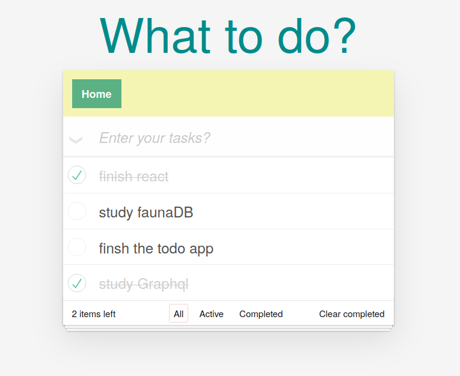

# Todo React App using slash GraphQL powered by Dgraph


### GraphQL Schema Design:


```graphql
type User {
  	username: String! @id @search(by: [hash])
   	name: String @search(by: [exact])
  	tasks: [Task]
}

type Task {
  	id:ID!
    title: String! @search(by: [fulltext])
  	completed: Boolean! @search
  	user: [User] @hasInverse(field: tasks)
}
```


## Bring up ToDo App

### `npm install`

Install the dependencies needed to bring up the application.

### `npm start`

Runs the Todo application.<br />
Open [http://localhost:3000](http://localhost:3000) to view it in the browser.

### `npm run build`

Compiles the Todo application and minifies to generate the production build.

## Screenshots


---
